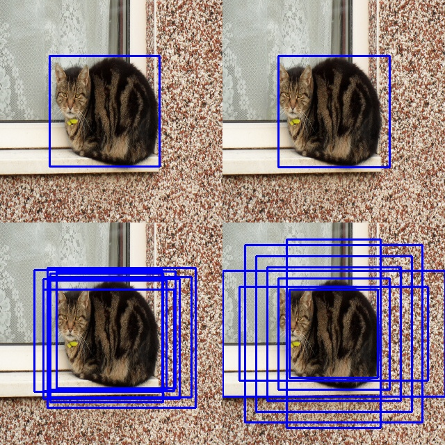
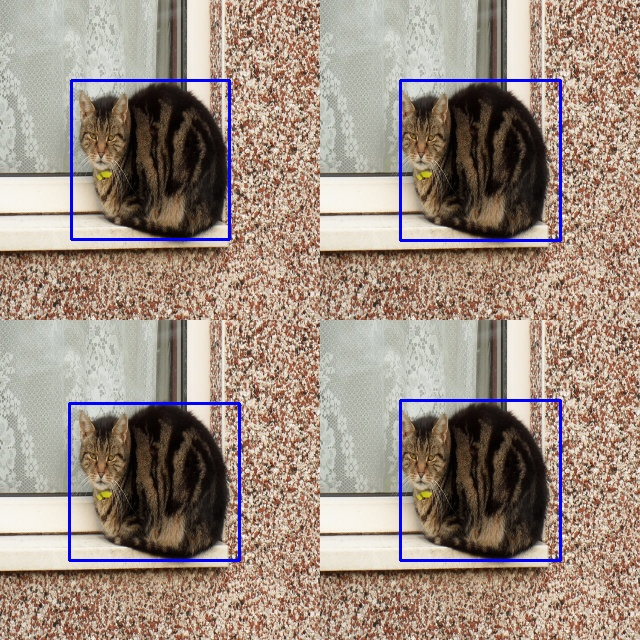
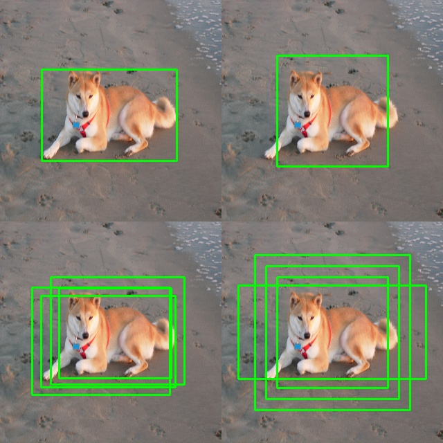
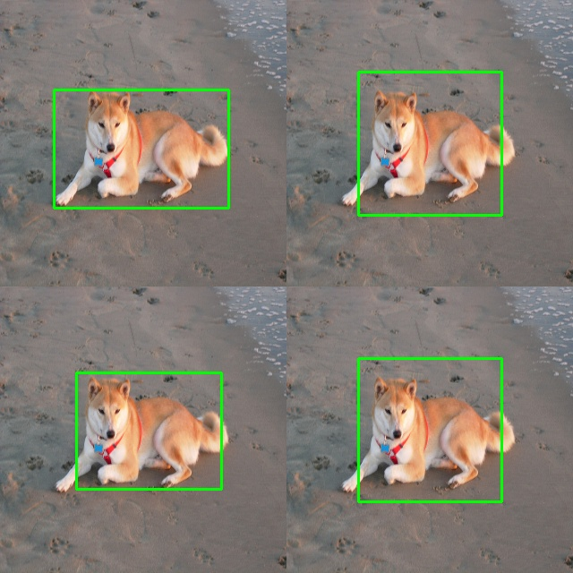
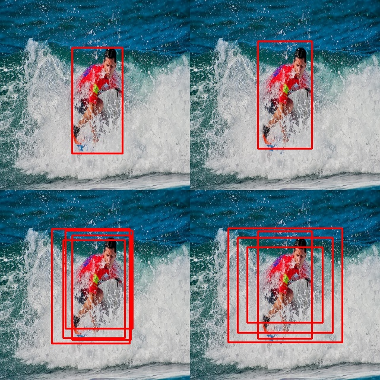
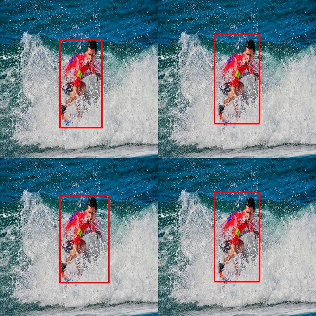
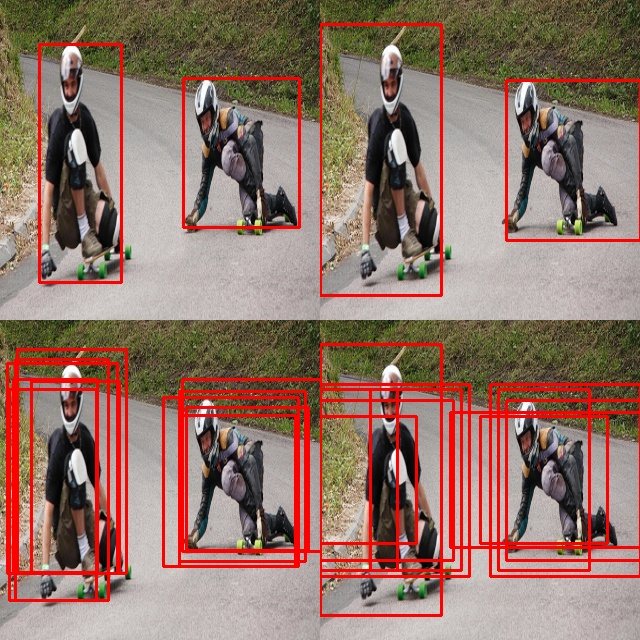
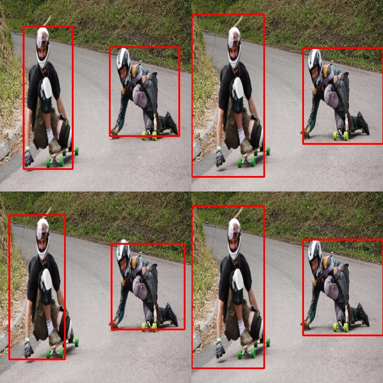

## Object Detection: SSD (Singel Shot Multibox Detector)
This model is based on a SSD architecture proposed in ECCV 2016 paper **SSD: Single Shot MultiBox Detector** by Wei Liu, Dragomir Anguelov, Dumitru Erhan, Christian Szegedy, Scott Reed, Cheng-Yang Fu, Alexander C. Berg.

## Quick Start
### Dependencies and Environment
- PyTorch >= 0.4.0
- Numpy >= 1.15
- Python >=3.5.0
- OpenCV
- Dataset [Download](https://drive.google.com/u/0/uc?id=197RBFt2niCcVNPmEUwzp3ds5LsWxZVxd&export=download) and extract it under default repository


### Train from scratch
```python
python main.py
```
you can specify training epochs, learning rate, batch size and if using augmentation. such as
```python
python main.py --epoch 300 --lr 0.01 --batch_size 16 --aug True
```


### Evaluate with Your checkpoints
```python
python main.py --test --epoch {SAVED_CHECKPOINT_NUMBER} --txt 3
```
--txt specifiy which dataset to test 1-train set 2-validation set 3-test set

### Results
cat **before** NMS



cat **after** NMS



dog **before** NMS



dog **after** NMS



one person **before** NMS



one person **after** NMS



two persons **before** NMS



two persons **after** NMS



